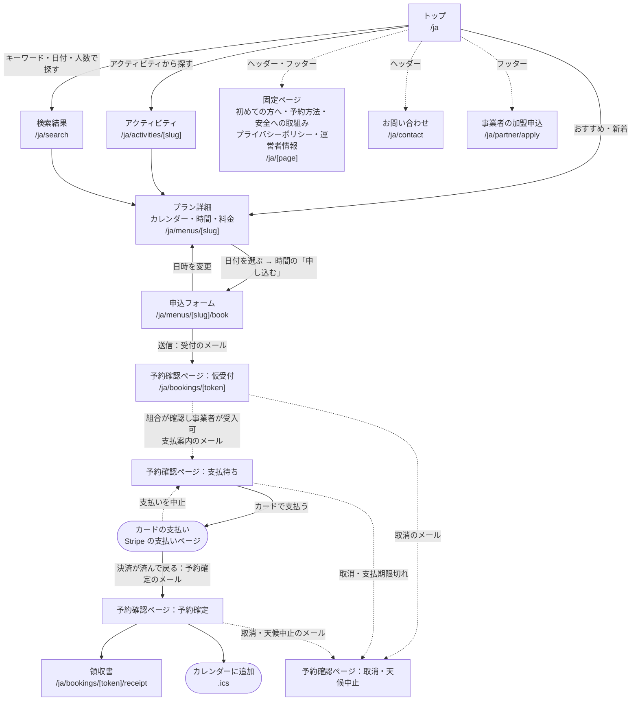
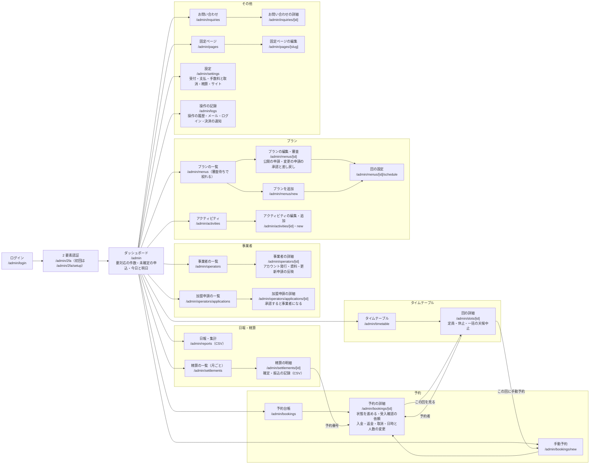
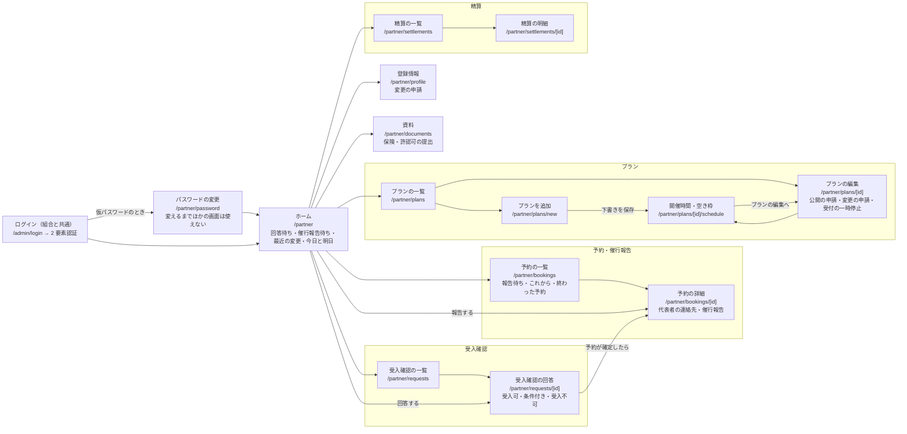
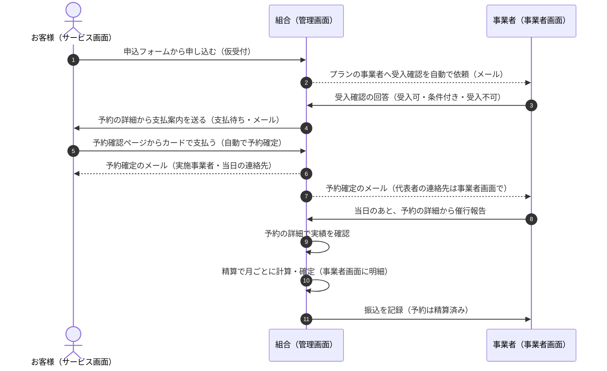
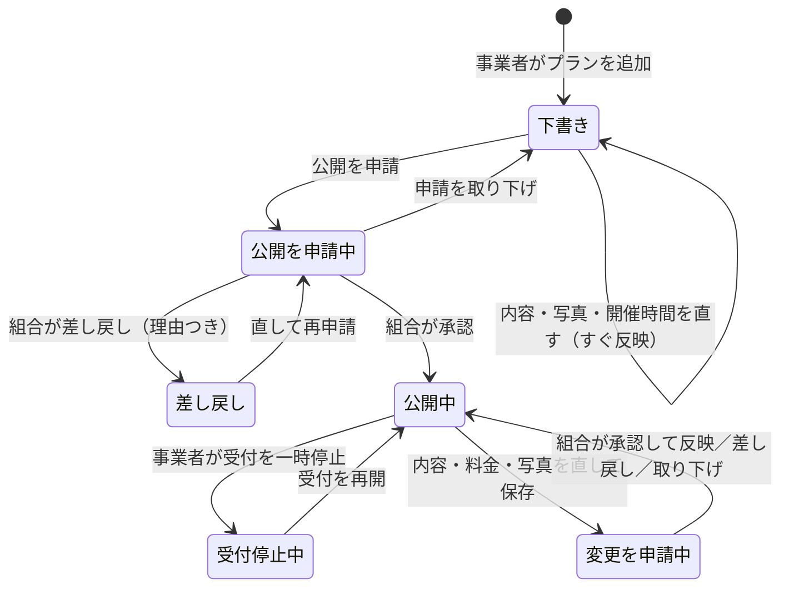

# 画面遷移図

2026-10-01 時点の実装をもとに作成。画面の URL は `src/app` のルートと同じ（`[slug]` などは中身が変わる部分）。
図は Mermaid で書いている（GitHub・VS Code のプレビュー・Obsidian でそのまま図になる）。

- [1. サービス画面（お客様向けサイト）](#1-サービス画面お客様向けサイト)
- [2. 管理画面（組合）](#2-管理画面組合)
- [3. 管理画面（事業者画面）](#3-管理画面事業者画面)
- [4. 予約の流れ（お客様・組合・事業者の画面のつながり）](#4-予約の流れお客様組合事業者の画面のつながり)
- [5. プランの登録と審査（事業者・組合）](#5-プランの登録と審査事業者組合)

凡例：実線の矢印は画面の移動（リンク・ボタン）、点線の矢印はメールや状態の変化で次の画面へ進むもの。

## 1. サービス画面（お客様向けサイト）

- 予約確認ページ（`/ja/bookings/[token]`）は、ログインのかわりにメールのリンク（推測できない URL）で開く。状態によって表示が変わる。
- カード決済の鍵（Stripe）を設定していないあいだは、支払待ちのページに振込先の案内を出す（組合が入金を記録すると予約確定）。

## 2. 管理画面（組合）

- 左のメニューから、どの画面へも直接移れる（図ではダッシュボードからの矢印で表す）。
- ダッシュボードのタイル（新規申込・事業者の回答あり・支払期限切れ・プランの審査・登録申請など）から、その条件で絞った一覧へ移る。

## 3. 管理画面（事業者画面）

- 事業者に見せるのは、自社に照会・割り当てされた予約と、自社が掲載元のプランだけ（ほかの事業者のものは URL を開いても見られない）。
- お客様の氏名・電話番号は、予約が確定してから出す。

## 4. 予約の流れ（お客様・組合・事業者の画面のつながり）

- 取消・天候中止は、組合が予約の詳細（1 件ずつ）か回の詳細（回まるごと）から行い、お客様と事業者へメールで知らせる。

## 5. プランの登録と審査（事業者・組合）

- 公開中も、開催時間・休み・定員（空き枠）の変更と受付の一時停止は、組合の承認なしですぐ反映する。
